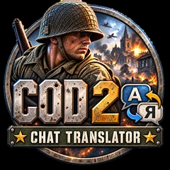
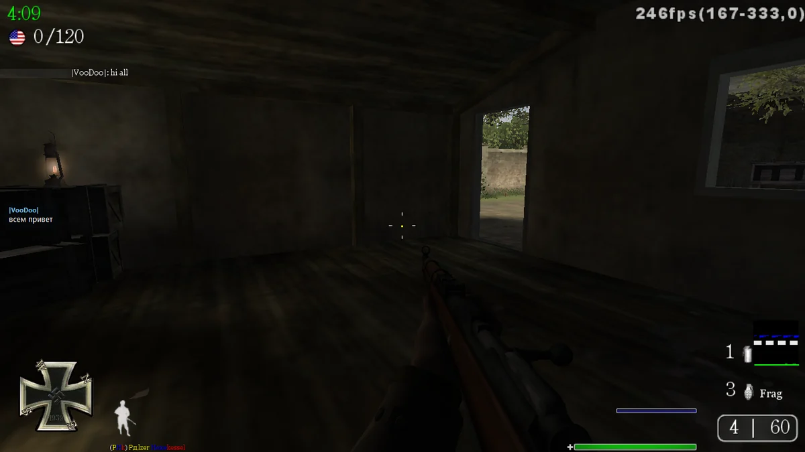
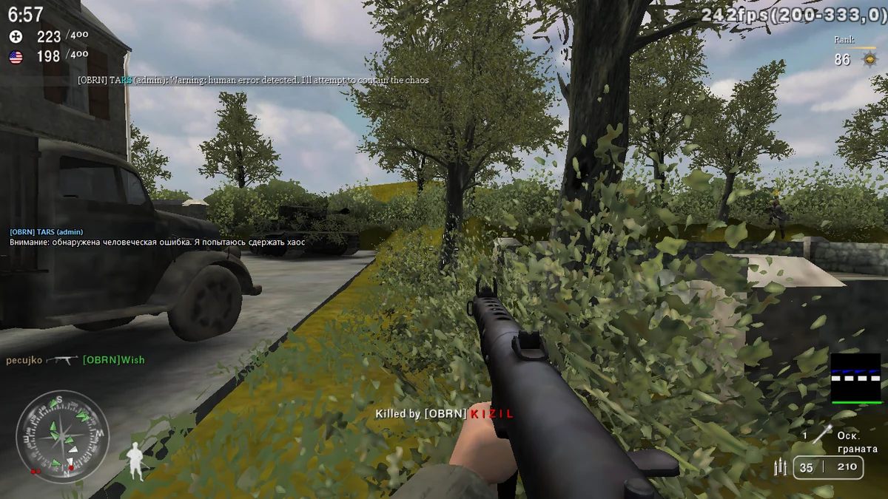
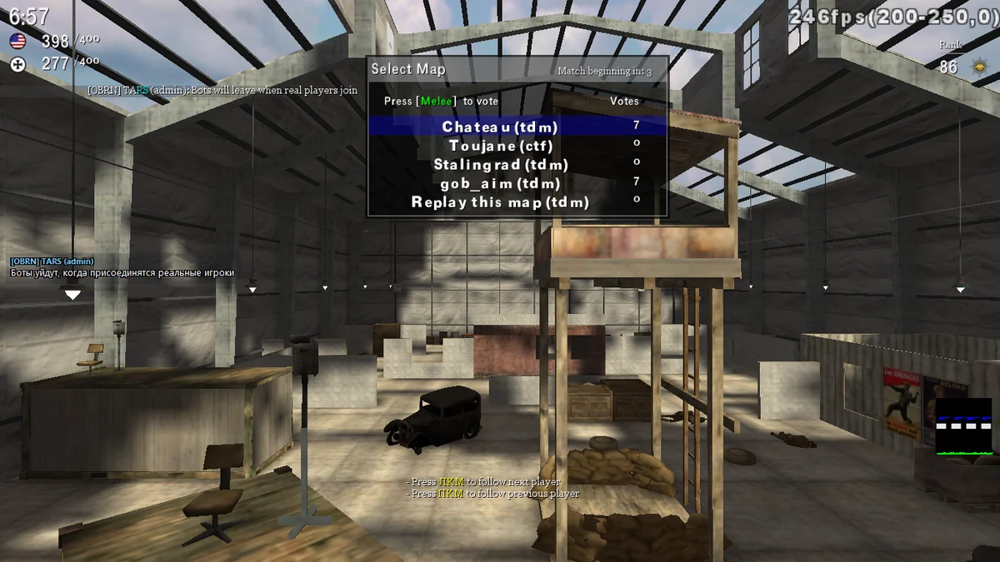
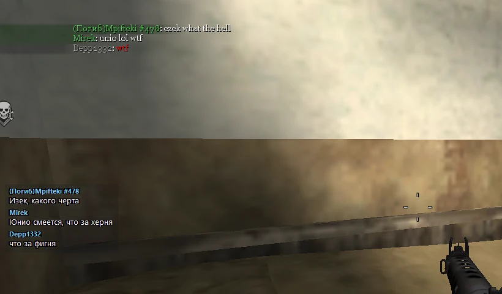
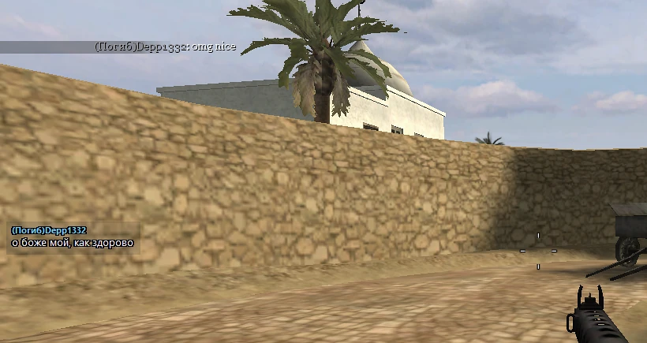
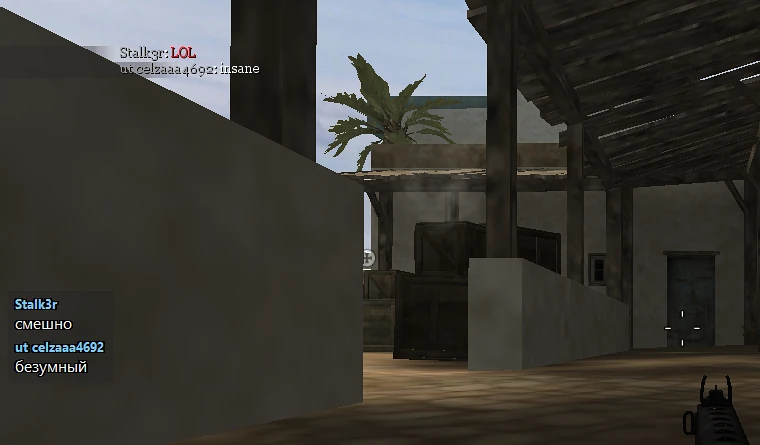
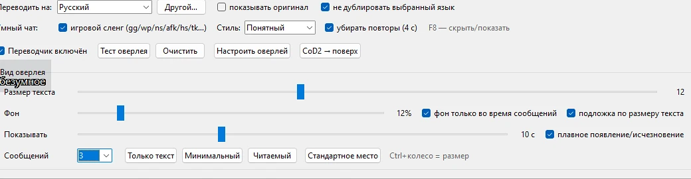

# COD 2 Chat Translator

<p align="center">
  
</p>

<p align="center"><a href="README_RU.md">Русская версия</a></p>

**A Windows chat translator for Call of Duty 2 Multiplayer that works while you play.**

CoD2 still has players from many countries, so mixed-language chat is pretty common.

COD 2 Chat Translator reads chat from `console_mp.log`, translates new messages and shows the result in a small overlay over the game.

No DLL injection and no game-memory modification.

## In game

The original message stays in the CoD2 chat while the translation appears in a small overlay:



Long admin messages and short gaming slang work too:

<p align="center">
  
  
</p>

### More screenshots

These are larger crops from real gameplay. They are intentionally focused on the chat area so both the original CoD2 message and the translated overlay remain readable directly on GitHub.

<p align="center">
  
</p>

<p align="center">
  
</p>

<p align="center">
  
</p>

Text size, background opacity, display time and visible-message count can all be adjusted from the app:

<p align="center">
  
</p>

## How it works

CoD2 can write its console output to `console_mp.log`. The translator watches new lines and filters player chat from map-loading output, dvars, file paths and other service messages.

When a player writes something, the app detects the source language, translates the message to your selected language and shows it in the overlay for a few seconds. The original message can also be shown if you want it.

## First launch

Install the app with `Setup.exe` and start it from the shortcut.

Starting with v1.15.0 you no longer need to enter `/seta logfile 2` manually. The translator discovers `config_mp.cfg` inside the detected CoD2 installation and enables `logfile 2` itself. No profile name or drive letter is hard-coded: `main`, direct mod folders, nested `mods\<name>` layouts and compatible portable/non-Steam copies are checked. An original backup is kept before a config is changed.

If Multiplayer is already running while logging is disabled, the app does not rewrite the config currently owned by the game. Exit Multiplayer once; the translator applies the setting automatically, and logging is active on the next game launch.

The app tries to find CoD2 and its logs automatically. Steam may be installed on any drive: the translator reads registered Steam locations and `libraryfolders.vdf`. If Multiplayer is running, the app also resolves the full install path directly from the `CoD2MP_s.exe` process, which works for Steam, portable and many non-Steam copies.

For non-Steam installs it also checks common `Games`, `COD2` and `Call of Duty 2` locations on local fixed drives without recursively scanning the whole computer.

If automatic detection still fails, open **Server settings… → Choose game folder…** and select the folder containing `CoD2MP_s.exe` once. The translator will then find `console_mp.log` files for mods and servers inside that install automatically. Picking an individual `.log` remains an advanced fallback.

Choose the language you want to read and start playing.

> Translation requires an internet connection. Only the extracted chat-message text is sent to the online translation service.

## Servers and profiles

CoD2 servers with mods often use their own `fs_game` folders, which means different servers or mods may write chat to different files, for example:

```text
Call of Duty 2\main\console_mp.log
Call of Duty 2\example_mod\console_mp.log
Call of Duty 2\mods\example_mod\console_mp.log
Call of Duty 2\vetdm\console_mp.log
```

**Automatic active-server detection** is enabled by default. In the main window this is reduced to a simple **“Server: ● Automatic”** status, so technical log paths and mod-folder names stay out of the way.

While the translator is running, it periodically rescans the CoD2 folder. If a different `console_mp.log` starts changing after you join another server, the translator switches to it automatically. A newly created mod folder and log can also be discovered without restarting the app.

Log paths are still stored internally as **profiles** for the manual fallback. Open **Server settings…** to choose the game folder once, select a specific log, rename a profile, or run automatic discovery again.

Only **one active log** is translated at a time. If several servers use the same mod folder, they share the same internal profile.

Manual mode remains available for unusual CoD2 installations or servers that automatic detection cannot recognize.

## Overlay

The overlay can be moved, resized and tuned to stay out of the way.

You can change text size, background opacity, visible-message count and message lifetime. Ready-made presets are included as well.

After the overlay is locked, it becomes click-through so it does not steal the mouse from the game.

`F8` hides or shows the overlay without stopping translation.

## Gaming slang

Normal machine translation often struggles with short FPS chat, so common gaming terms are handled before regular translation.

Examples include `gg`, `wp`, `ns`, `nt`, `afk`, `brb`, `tk`, `nade`, `smoke`, `rush`, `camp`, `spawncamp`, `votekick`, `fps drop` and more.

There are three styles:

- **Clear** — simple wording without much gaming jargon.
- **Natural** — shorter wording closer to normal game chat.
- **Uncensored** — keeps rough language when the original is already rough. It does not add profanity to a neutral message.

## Languages

The source language is detected automatically. You only choose the language you want to read.

## Settings

The app remembers the selected profile, overlay position, text size, background, language, slang style and other options.

Installed-app settings are stored separately in:

```text
%APPDATA%\CoD2ChatTranslator
```

Updating the program should therefore keep your existing overlay setup and profile list.

## Updates

The app can check GitHub Releases for a newer version. Update packages are verified with SHA256 before installation, and the updater attempts to roll back replaced files if installation fails. If Setup is run over an older version that is still open, it closes the translator before replacing its files.

## Privacy

`console_mp.log` can contain more than chat, including server parameters or passwords.

**Do not publish the complete log.**

The app filters it locally and sends only the extracted chat-message text to the translation service.

## Build from source

For a local Windows build you need Python 3.12+ and Inno Setup.

Run:

```bat
BUILD_RELEASE.bat
```

GitHub Actions also builds and checks the Windows installer automatically.

## Project

Developer: **[kriskarter](https://github.com/kriskarter)**

If the app is useful, you can leave a ⭐ on the repository.

---

Unofficial fan-made utility. Not affiliated with or endorsed by Activision. Call of Duty and related marks belong to their respective owners.
