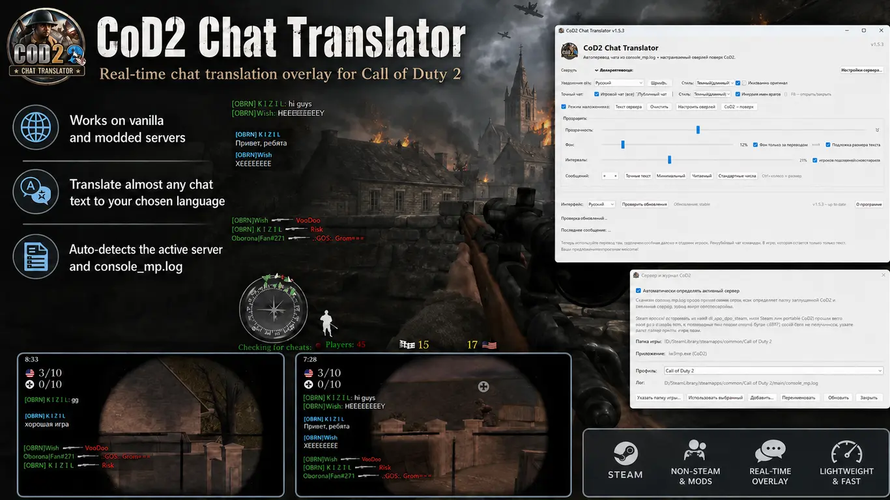
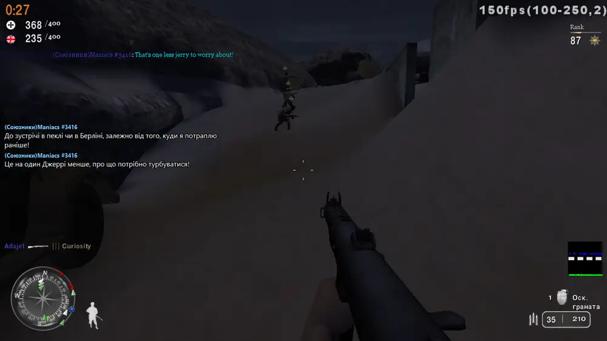
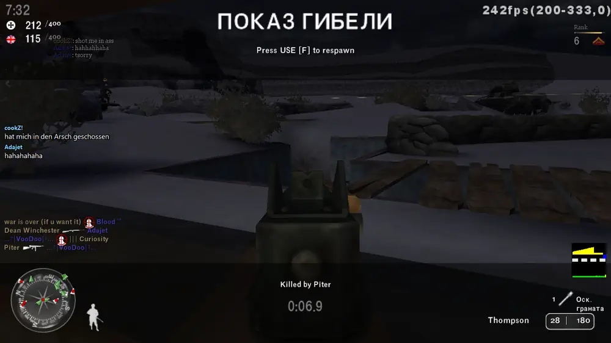
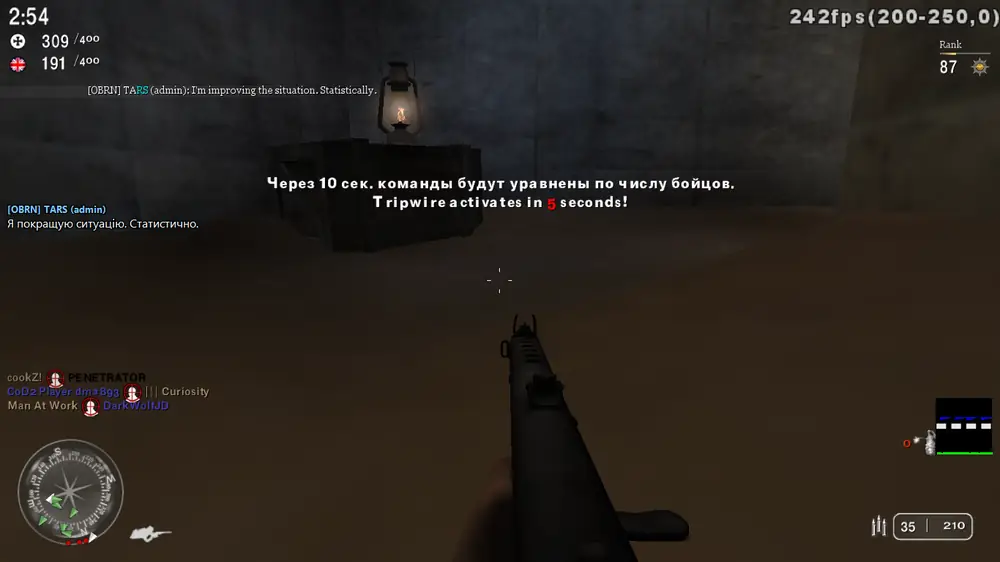
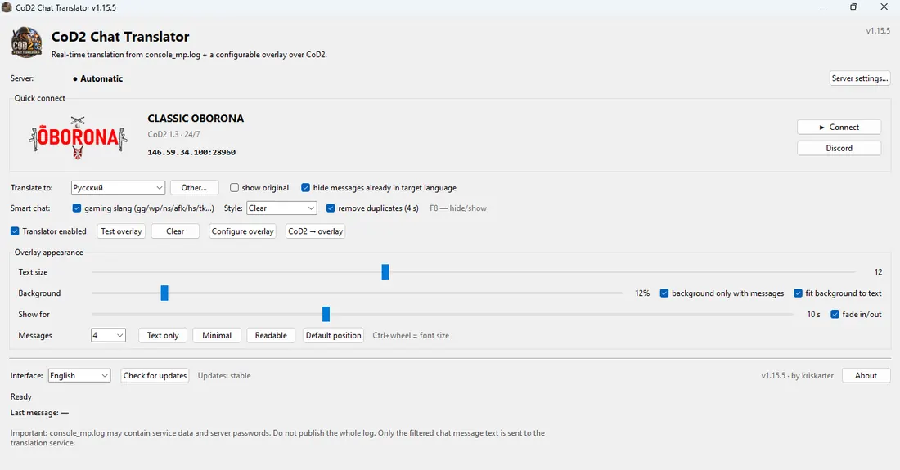
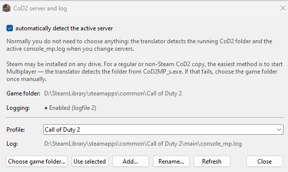

# COD 2 Chat Translator

<p align="center">
  
</p>

<p align="center">
  <strong>English</strong> ·
  <a href="README_RU.md">Русский</a> ·
  <a href="README_UK.md">Українська</a>
</p>

<p align="center">
  
</p>

<p align="center">
  <a href="https://github.com/kriskarter/cod2-chat-translator/releases/latest">
    
  </a>
</p>

<p align="center">
  Open the latest release and download <code>CoD2ChatTranslator_Setup_*.exe</code>.
</p>


**A Windows chat translator for Call of Duty 2 Multiplayer that works while you play.**

CoD2 still has players from many countries, so mixed-language chat is pretty common.

COD 2 Chat Translator reads chat from `console_mp.log`, translates new messages and shows the result in a small overlay over the game.

No DLL injection and no game-memory modification.

## What's new in v1.16

The translator now works in both directions.

- **Incoming chat** — translates other players' messages.
- **Outgoing chat · F9** — type in your language, preview the translation and send it directly to CoD2 chat.
- **Screenshots · F10** — capture the game together with translator overlays.
- **English / Russian / Ukrainian interface**.
- **v1.16.1** improves Windows administrator-elevation and update compatibility.

## Hotkeys

| Key | Action |
| --- | --- |
| **F8** | Hide / show incoming translation overlay |
| **F9** | Open / close outgoing translated chat |
| **F10** | Save gameplay screenshot with overlays |

## In game

The original message stays in the CoD2 chat while the translation appears in a small overlay. The incoming language is detected automatically, while you choose the language you want to read.

### Live multilingual examples

These screenshots were captured during real multiplayer gameplay. The first example translates chat to Ukrainian, while the second uses German as the output language:

<p align="center">
  
  
</p>

Admin chat is handled in the same overlay:

<p align="center">
  
</p>

Ordinary player chat, short FPS-style messages, gaming slang and admin chat can all be translated while you play.

Text size, background opacity, display time and visible-message count can all be adjusted from the app.


## How it works

CoD2 can write its console output to `console_mp.log`. The translator watches new lines and filters player chat from map-loading output, dvars, file paths and other service messages.

When a player writes something, the app detects the source language, translates the message to your selected language and shows it in the overlay for a few seconds. The original message can also be shown if you want it.

### What can be translated

The translator is not limited to an “English → Russian” workflow. **The incoming message language is detected automatically**, while the output language is chosen by you. Players can therefore mix English, Polish, German, Russian and other languages supported by the translation service in the same chat without manually switching the source language.

The app includes **40 built-in target languages**: Russian, Ukrainian, English, German, Polish, Spanish, French, Italian, Portuguese, Czech, Slovak, Romanian, Hungarian, Turkish, Dutch, Scandinavian and Balkan languages, Arabic, Hebrew, Hindi, Japanese, Korean, Chinese and more. **Other…** also accepts an additional Google Translate language code.

It is not only for long sentences. Short replies, ordinary chat and common FPS slang are handled as well. Russian typed with Latin letters — for example `privet`, `kak dela`, `spasibo` — is recognized conservatively so normal English chat is not blindly transliterated.

The gameplay examples above use Ukrainian and German as output languages. The same workflow works with any supported target language.

## First launch

Install the app with `Setup.exe` and start it from the shortcut.

The installer supports **English, Russian and Ukrainian**.

Starting with **v1.16.1**, Windows asks for administrator permission when the application starts. This is expected: elevated access is used for reliable global hotkeys and outgoing chat interaction with CoD2.

<p align="center">
  
</p>

Starting with **v1.15.5**, the main window includes **Quick Connect** for the featured CLASSIC OBORONA server. When CoD2 is closed, **Connect** launches Multiplayer and joins the server directly. The **Discord** button opens the server community invite. If CoD2 is already running, the translator avoids starting a second copy of the game.

Starting with v1.15.0 you no longer need to enter `/seta logfile 2` manually. The translator discovers `config_mp.cfg` inside the detected CoD2 installation and enables `logfile 2` itself. No profile name or drive letter is hard-coded: `main`, direct mod folders, nested `mods\<name>` layouts and compatible portable/non-Steam copies are checked. An original backup is kept before a config is changed.

If Multiplayer is already running while logging is disabled, the app does not rewrite the config currently owned by the game. Exit Multiplayer once; the translator applies the setting automatically, and logging is active on the next game launch.

The app tries to find CoD2 and its logs automatically. Steam may be installed on any drive: the translator reads registered Steam locations and `libraryfolders.vdf`. If Multiplayer is running, the app also resolves the full install path directly from the `CoD2MP_s.exe` process, which works for Steam, portable and many non-Steam copies.

For non-Steam installs it also checks common `Games`, `COD2` and `Call of Duty 2` locations on local fixed drives without recursively scanning the whole computer.

If automatic detection still fails, open **Server settings… → Choose game folder…** and select the folder containing `CoD2MP_s.exe` once. The translator will then find `console_mp.log` files for mods and servers inside that install automatically. Picking an individual `.log` remains an advanced fallback.

Choose the language you want to read and start playing.

> Translation requires an internet connection. Only the extracted chat-message text is sent to the online translation service.

## Servers and profiles

CoD2 servers with mods often use their own `fs_game` folders, which means different servers or mods may write chat to different files, for example:

```text
Call of Duty 2\main\console_mp.log
Call of Duty 2\example_mod\console_mp.log
Call of Duty 2\mods\example_mod\console_mp.log
Call of Duty 2\vetdm\console_mp.log
```

**Automatic active-server detection** is enabled by default. In the main window this is reduced to a simple **“Server: ● Automatic”** status, so technical log paths and mod-folder names stay out of the way.

While the translator is running, it periodically rescans the CoD2 folder. If a different `console_mp.log` starts changing after you join another server, the translator switches to it automatically. A newly created mod folder and log can also be discovered without restarting the app.

Log paths are still stored internally as **profiles** for the manual fallback. Open **Server settings…** to choose the game folder once, select a specific log, rename a profile, or run automatic discovery again.

<p align="center">
  
</p>

Only **one active log** is translated at a time. If several servers use the same mod folder, they share the same internal profile.

Manual mode remains available for unusual CoD2 installations or servers that automatic detection cannot recognize.

## Outgoing chat · F9

Press **F9** while playing to open the outgoing-chat overlay.

Choose:

- **My language** — the language you type in;
- **Send as** — the language other players should receive.

Then:

1. Type your message.
2. Press **Enter** once to translate it.
3. Check the translated preview.
4. Press **Enter** again to send it to CoD2 all-chat.

Press **Esc** or **F9** to cancel.

Incoming and outgoing translation settings are independent. For example, you can read server chat in Ukrainian while sending your own messages in English.

The outgoing-chat feature can be disabled from the main window. When disabled, F9 is passed through to the game normally.

## Overlay

The overlay can be moved, resized and tuned to stay out of the way.

You can change text size, background opacity, visible-message count and message lifetime. Ready-made presets are included as well.

After the overlay is locked, it becomes click-through so it does not steal the mouse from the game.

`F8` hides or shows the overlay without stopping translation.

## Screenshots · F10

Press **F10** during the game to save a screenshot of the monitor containing CoD2.

The screenshot includes the translator overlays and is saved as PNG in:

%USERPROFILE%\Pictures\CoD2 Chat Translator\Screenshots

The same action is available from the **Screenshot · F10** button in the main window.

## Gaming slang

Normal machine translation often struggles with short FPS chat, so common gaming terms are handled before regular translation.

Examples include `gg`, `wp`, `ns`, `nt`, `afk`, `brb`, `tk`, `nade`, `smoke`, `rush`, `camp`, `spawncamp`, `votekick`, `fps drop` and more.

There are three styles:

- **Clear** — simple wording without much gaming jargon.
- **Natural** — shorter wording closer to normal game chat.
- **Uncensored** — keeps rough language when the original is already rough. It does not add profanity to a neutral message.

## Languages

The source language is detected automatically by the translation service. You only choose the output language.

The current UI includes 40 ready-made target languages, and **Other…** accepts an additional language code. Translation pairs are not fixed: English → Russian, Polish → Ukrainian, German → English, Russian → Polish and many other combinations work the same way.

If a message is already in your selected language, the **do not duplicate selected language** option keeps the overlay from showing an unnecessary copy.

## Settings

The app remembers the selected profile, overlay position, text size, background, language, slang style and other options.

Installed-app settings are stored separately in:

```text
%APPDATA%\CoD2ChatTranslator
```

Updating the program should therefore keep your existing overlay setup and profile list.

## Updates

The app can check GitHub Releases for a newer version.

Starting with v1.15.4, update metadata is protected with an **Ed25519 digital signature**. The application verifies that signature with its embedded public key before accepting an update. The downloaded update ZIP is then checked against its signed SHA256 value before installation.

The updater attempts to roll back replaced files if installation fails. If Setup is run over an older version that is still open, it closes the translator before replacing its files.

## Privacy

`console_mp.log` can contain more than chat, including server parameters or passwords.

**Do not publish the complete log.**

The app filters it locally and sends only the extracted chat-message text to the translation service.

## Troubleshooting

Problems with F9, overlays, game detection, screenshots or updates are covered here:

**[Troubleshooting guide](docs/TROUBLESHOOTING.md)**

## Build from source

For a local Windows build you need Python 3.12+ and Inno Setup.

Run:

```bat
BUILD_RELEASE.bat
```

GitHub Actions also builds and checks the Windows installer automatically.

## Source code

The source code is public for transparency and inspection, but this project is
**not released under an open-source license**. See [COPYRIGHT.md](COPYRIGHT.md).

Visual asset provenance is documented in
[docs/ASSET_PROVENANCE.md](docs/ASSET_PROVENANCE.md).

## Project

Developer: **[kriskarter](https://github.com/kriskarter)**

If the app is useful, you can leave a ⭐ on the repository.

---

Unofficial fan-made utility. Not affiliated with or endorsed by Activision. Call of Duty and related marks belong to their respective owners.
