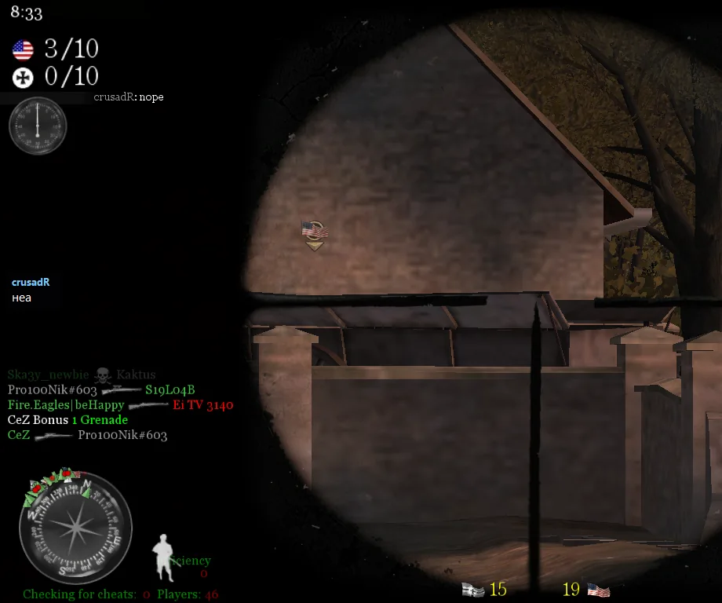
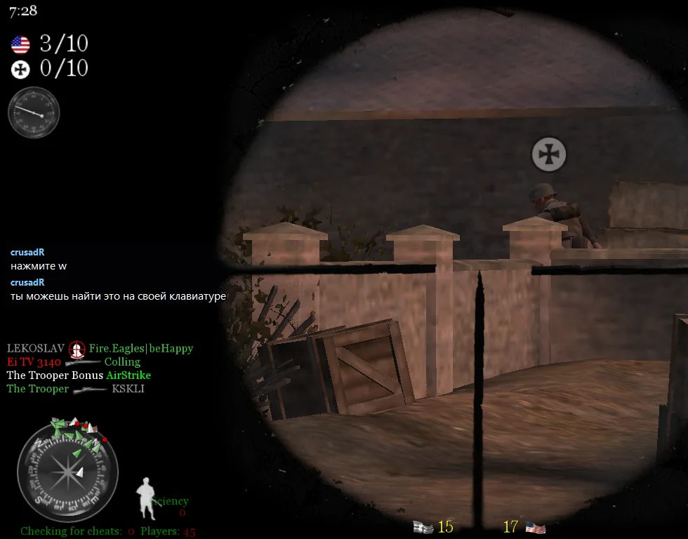
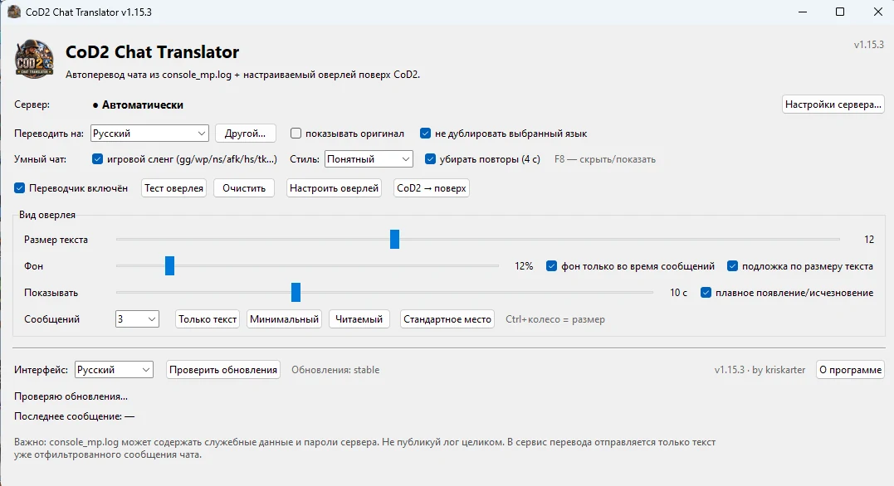
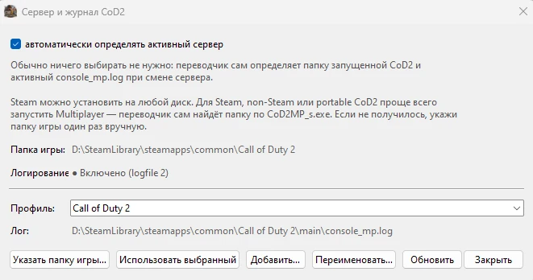

# COD 2 Chat Translator

<p align="center">
  
</p>

<p align="center">
  <a href="README.md">English</a> ·
  <strong>Русский</strong> ·
  <a href="README_UK.md">Українська</a>
</p>

<p align="center">
  
</p>

<p align="center">
  <a href="https://github.com/kriskarter/cod2-chat-translator/releases/latest">
    
  </a>
</p>

<p align="center">
  Открой последний релиз и скачай <code>CoD2ChatTranslator_Setup_*.exe</code>.
</p>


**Переводчик чата для Call of Duty 2 Multiplayer, который работает прямо во время игры.**

В CoD2 до сих пор играют люди из разных стран, поэтому языковой барьер в чате — обычная история.

COD 2 Chat Translator читает игровой чат из `console_mp.log`, переводит новые сообщения и показывает перевод небольшим оверлеем поверх игры.

Никаких DLL-инъекций и вмешательства в память игры.

## Что нового в v1.17

Исходящий чат стал быстрее и удобнее прямо во время игры.

**F9 → пишешь текст → перевод появляется сам → Enter отправляет.**

Больше не нужно нажимать первый Enter только для перевода. После короткой паузы во время ввода программа автоматически показывает актуальный перевод.

Если нажать Enter раньше, чем перевод успел завершиться, программа сама дождётся результата и отправит сообщение.

## Что нового в v1.16

Теперь переводчик работает **в обе стороны**.

- **Входящий чат** — переводит сообщения других игроков.
- **Исходящий чат · F9** — пишешь на своём языке, проверяешь перевод и отправляешь его прямо в CoD2.
- **Скриншоты · F10** — сохраняют игру вместе с оверлеями переводчика.
- Интерфейс и установщик поддерживают **русский, украинский и английский**.
- **v1.16.1** исправляет совместимость обновлений со старыми версиями.

## Горячие клавиши

| Клавиша | Действие |
| --- | --- |
| **F8** | Скрыть / показать оверлей входящего перевода |
| **F9** | Открыть / закрыть исходящий переведённый чат |
| **F10** | Сделать игровой скриншот вместе с оверлеями |

## Как выглядит в игре

Оригинальное сообщение остаётся в чате CoD2, а перевод появляется отдельным компактным оверлеем. Исходный язык программа определяет автоматически — ты выбираешь только язык, на котором хочешь читать чат.

### Живые примеры на разных языках

Эти скриншоты сделаны прямо во время игры. В первом примере чат переводится на украинский, во втором выбран немецкий:

<p align="center">
  
  
</p>

Сообщения администраторов отображаются в том же оверлее:

<p align="center">
  
</p>

Так работают обычный чат игроков, короткие FPS-фразы, игровой сленг и сообщения администраторов.

Размер текста, фон, время показа и количество сообщений на экране настраиваются прямо в приложении.


## Как это работает

CoD2 умеет писать консоль в файл `console_mp.log`. Переводчик следит за новыми строками и отделяет сообщения игроков от загрузки карт, dvar-параметров, путей к файлам и другого служебного вывода.

Когда появляется сообщение игрока, программа сама определяет язык, переводит текст на выбранный тобой язык и на несколько секунд выводит результат в оверлей. При желании рядом можно показывать оригинал.

### Что именно переводится

Переводчик не привязан к схеме «английский → русский». **Язык входящего сообщения определяется автоматически**, а результат можно выводить на выбранный тобой язык. Поэтому в одном чате могут подряд писать на английском, польском, немецком, русском или другом поддерживаемом сервисом языке — вручную переключать исходный язык не нужно.

В интерфейсе уже есть **40 готовых языков перевода**: русский, украинский, английский, немецкий, польский, испанский, французский, итальянский, португальский, чешский, словацкий, румынский, венгерский, турецкий, нидерландский, скандинавские и балканские языки, арабский, иврит, хинди, японский, корейский, китайский и другие. Кнопка **«Другой…»** позволяет указать дополнительный код языка Google Translate.

Работают не только длинные предложения. Переводятся короткие ответы, обычный разговорный текст и игровой сленг. Русский текст, набранный латиницей — например `privet`, `kak dela`, `spasibo` — тоже распознаётся отдельной осторожной логикой, чтобы не ломать настоящий английский чат.

Короткий ответ:

<p align="center">
  
</p>

Обычная фраза из игрового чата:

<p align="center">
  
</p>

## Первый запуск

Установи программу через `Setup.exe` и запусти её с ярлыка.

Установщик поддерживает **русский, украинский и английский**.

Начиная с **v1.16.1**, Windows запрашивает права администратора при запуске приложения. Это нормальное поведение: повышенные права нужны для глобальных горячих клавиш и работы исходящего чата с CoD2.

<p align="center">
  
</p>

Начиная с **v1.15.5**, в главном окне есть **«Быстрый вход»** на приоритетный сервер CLASSIC OBORONA. Если CoD2 закрыта, кнопка **«Подключиться»** запускает Multiplayer и сразу соединяет с сервером. Кнопка **Discord** открывает приглашение сообщества. Если игра уже запущена, переводчик не пытается запускать второй экземпляр.

Начиная с v1.15.0 вручную вводить `/seta logfile 2` больше не нужно. Переводчик сам ищет `config_mp.cfg` внутри найденной установки CoD2 и включает `logfile 2`. Имя профиля и конкретная буква диска не зашиты в программу: проверяются `main`, папки модов, вложенные `mods\<имя>` и совместимые portable/non-Steam варианты. Перед изменением создаётся резервная копия исходного конфига.

Если Multiplayer уже запущен и логирование было выключено, программа не переписывает используемый игрой конфиг на лету. Закрой Multiplayer один раз — переводчик применит настройку автоматически, после следующего запуска игры лог уже будет создаваться.

При первом запуске программа попробует найти CoD2 и игровые логи сама. Steam может находиться на любом диске: переводчик читает зарегистрированные библиотеки Steam и `libraryfolders.vdf`. Если запущен Multiplayer, программа дополнительно определяет полный путь прямо по процессу `CoD2MP_s.exe` — это работает и для Steam, portable и многих non-Steam сборок.

Для non-Steam установок также проверяются типичные папки `Games`, `Игры`, `COD2`, `Call of Duty 2` на локальных дисках без медленного полного сканирования компьютера.

Если автоматика всё же не нашла игру, открой **«Настройки сервера…» → «Указать папку игры…»** и один раз выбери папку, где лежит `CoD2MP_s.exe`. Дальше переводчик сам будет искать внутри неё `console_mp.log` всех модов и серверов. Ручной выбор конкретного `.log` остаётся только запасным вариантом.

После этого выбери язык перевода и можно играть.

> Для перевода нужен интернет: в онлайн-сервис отправляется только текст распознанного сообщения чата.

## Серверы и профили

У CoD2 есть одна особенность: серверы с модами часто используют собственные папки `fs_game`. Поэтому разные серверы или моды могут писать чат в разные файлы, например:

```text
Call of Duty 2\main\console_mp.log
Call of Duty 2\example_mod\console_mp.log
Call of Duty 2\mods\example_mod\console_mp.log
Call of Duty 2\vetdm\console_mp.log
```

По умолчанию включено **автоматическое определение активного сервера**. В главном окне при этом достаточно видеть **«Сервер: ● Автоматически»** — технический путь к логу и имя мод-папки не мешают.

Пока программа работает, она периодически пересканирует папку CoD2. Если после подключения к другому серверу начнёт обновляться другой `console_mp.log`, переводчик сам переключится на него. Если появится новая мод-папка с новым логом, она тоже будет обнаружена без перезапуска программы.

Пути к логам всё равно сохраняются как внутренние **профили**. Они нужны для ручного режима и находятся в окне **«Настройки сервера…»**. Там можно один раз указать папку игры, выбрать конкретный лог, переименовать профиль или повторно запустить автоматический поиск.

<p align="center">
  
</p>

Важно: одновременно переводится только **один активный лог**. Если несколько серверов используют одну и ту же мод-папку, для переводчика это будет один и тот же профиль.

Ручной режим остаётся запасным вариантом на случай необычной установки CoD2 или сервера, который автоматика не распознала.

## Исходящий чат · F9

Во время игры нажми **F9** — откроется небольшое окно исходящего чата.

Выбери:

- **«Мой язык»** — язык, на котором ты пишешь;
- **«Отправлять на»** — язык, на котором сообщение увидят другие игроки.

Дальше всё максимально быстро:

1. Пиши сообщение.
2. После короткой паузы перевод появится автоматически.
3. Нажми **Enter один раз** — переведённое сообщение отправится в общий чат CoD2.

Если нажать Enter сразу, не дожидаясь появления перевода, программа сама дождётся актуального результата и отправит сообщение.

**Esc** или повторное **F9** отменяют ввод.

Входящий и исходящий перевод настраиваются независимо.

Исходящий чат можно отключить в главном окне. Тогда F9 снова передаётся игре как обычная клавиша.

## Оверлей

Оверлей можно настроить под себя и потом просто оставить как есть.

Меняются размер текста, прозрачность фона, количество сообщений и время показа. Есть готовые варианты **«Только текст»**, **«Минимальный»** и **«Читаемый»**.

Через **«Настроить оверлей»** окно можно перетащить и изменить его размер. После фиксации мышь проходит сквозь оверлей, поэтому он не мешает игре.

`F8` — скрыть или вернуть оверлей. Сам перевод при этом продолжает работать.

## Скриншоты · F10

Нажми **F10** во время игры — программа сохранит PNG-снимок монитора с CoD2.

В кадр попадают и оверлеи переводчика.

Скриншоты сохраняются сюда:

%USERPROFILE%\Pictures\CoD2 Chat Translator\Screenshots

То же действие доступно через кнопку **«Скриншот · F10»** в главном окне.

## Игровой сленг

Обычный переводчик плохо понимает короткий игровой чат. Например, `camp` в FPS-контексте — это не «лагерь».

Поэтому перед обычным переводом программа отдельно разбирает частый игровой сленг: `gg`, `wp`, `ns`, `nt`, `afk`, `brb`, `tk`, `nade`, `smoke`, `rush`, `camp`, `spawncamp`, `votekick`, `fps drop` и другие выражения.

Есть три режима:

- **Понятный** — максимально простой смысл без лишнего жаргона.
- **Живой** — короткие формулировки ближе к обычному игровому чату.
- **Без цензуры** — не сглаживает грубость, если она уже есть в оригинале. Нейтральную фразу программа сама матерной не делает.

Например `stop camp` понимается как просьба перестать кемперить, а не как предложение «остановить лагерь».

## Языки

Исходный язык выбирать не нужно — он определяется автоматически сервисом перевода. Ты выбираешь только язык результата.

В текущем интерфейсе доступны 40 готовых языков назначения, а через **«Другой…»** можно ввести дополнительный код языка. Поэтому комбинации не фиксированы: английский → русский, польский → украинский, немецкий → английский, русский → польский и многие другие варианты работают одинаково.

Если сообщение уже написано на выбранном языке, опция **«не дублировать выбранный язык»** не показывает ненужную копию в оверлее.

## Настройки

Программа запоминает выбранный профиль, положение оверлея, размер текста, фон, язык, стиль сленга и остальные параметры.

Настройки установленной версии хранятся отдельно:

```text
%APPDATA%\CoD2ChatTranslator
```

Поэтому обычное обновление не должно сбрасывать уже настроенный оверлей или список профилей.

## Обновления

Проверить новую версию можно прямо из программы.

Начиная с v1.15.4 данные обновления защищены **цифровой подписью Ed25519**. Перед принятием обновления программа проверяет подпись встроенным публичным ключом, а затем сверяет скачанный ZIP с подписанным значением SHA256.

Если установка завершается ошибкой, обновлятор старается вернуть предыдущие файлы. Если Setup запускается поверх уже открытой старой версии, установщик закрывает переводчик перед заменой файлов.

## Приватность

`console_mp.log` содержит не только чат. В нём могут оказаться служебные параметры сервера и даже пароли.

**Не выкладывай полный `console_mp.log` в открытый доступ.**

Переводчик фильтрует файл локально. В сервис перевода уходит только текст уже распознанного сообщения чата, а не весь лог целиком.

## Если хочешь собрать сам

Для локальной Windows-сборки нужны Python 3.12+ и Inno Setup.

Запусти:

```bat
BUILD_RELEASE.bat
```

Та же сборка автоматически проверяется на Windows через GitHub Actions.

## Исходный код

Исходный код опубликован для прозрачности и возможности проверки, но проект
**не распространяется по open-source лицензии**. Подробнее:
[COPYRIGHT.md](COPYRIGHT.md).

Происхождение визуальных материалов описано в
[docs/ASSET_PROVENANCE.md](docs/ASSET_PROVENANCE.md).

## Проект

Разработчик: **[kriskarter](https://github.com/kriskarter)**

Если переводчик пригодился — можно поставить ⭐ репозиторию.

---

Это неофициальный фанатский проект. Он не связан с Activision и не одобрен ею. Call of Duty и связанные названия принадлежат их правообладателям.
